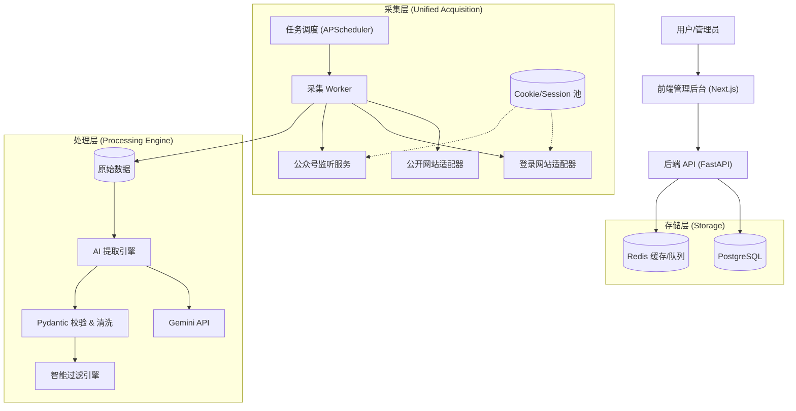

# 招标信息提取系统 - 技术架构方案 (brains.md)

本文档融合了多方头脑风暴的结果，旨在为“招标信息提取系统”提供一个可落地、高扩展的技术架构方案。

## 1. 系统愿景
构建一个自动化的招标信息情报系统，能够从公开网站、需登录平台及微信公众号等多种渠道实时采集数据，利用 LLM (Gemini) 进行非结构化数据的精准提取，并通过语义分析实现智能推送。

## 2. 核心架构设计

系统采用 **微服务化/模块化** 设计，主要分为四层：采集层、处理层、存储层、应用层。



---

## 3. 关键模块详细设计

### 3.1 统一采集层 (The "Eyes")
**目标**：屏蔽不同数据源的差异，提供统一的数据入口。

*   **抽象设计 (Adapter Pattern)**:
    定义 `DataSource` 接口，所有源必须实现：
    *   `fetch_list()`: 获取文章列表（处理分页）。
    *   `fetch_content(url)`: 获取详情。
    *   `validate_auth()`: 检查 Cookie/Token 是否有效。

*   **差异化处理策略**:
    *   **Type A: 公开静态/API**: 使用 `httpx` (Async) 高并发抓取。
    *   **Type B: 动态/需登录**: 使用 **Playwright**。
        *   *Cookie Store*: 建立统一的 Cookie 管理中心。支持手动录入、自动保活（定期访问刷新）、过期告警。
    *   **Type C: 微信公众号**:
        *   *方案*: 独立服务，维护 Cookie 池，轮询微信接口或使用第三方工具（如 WeChatFerry）监听。

*   **增量与去重**:
    *   基于 `URL` 或 `(来源, 项目编号)` 做唯一索引。
    *   Redis 记录 `Last-Modified` 或 `Latest-Article-ID`，只爬取新数据。

### 3.2 AI 智能提取层 (The "Brain")
**目标**：将非结构化 HTML/文本 转化为 结构化 JSON。

*   **Prompt Engineering (提示词工程)**:
    *   **JSON Mode**: 强制 Gemini 输出 JSON 格式。
    *   **Few-Shot (少样本)**: 在 Prompt 中植入 2-3 个“原文 -> 标准JSON”的示例，显著提升准确率。
    *   **Chain of Thought (思维链)**: 让 AI 先输出“分析思路”，再输出结果（如：先判断是否为废标公告）。

*   **数据校验与清洗**:
    *   **Pydantic Models**: 定义严格的数据模型（如 `Budget` 字段必须为 `float`，`Deadline` 必须为 `datetime`）。
    *   **自动修正**: 如果 AI 输出格式错误，自动将错误信息反馈给 AI 进行重试 (Self-Correction)。
    *   **置信度评分**: 要求 AI 输出 `confidence` 字段。低于 0.8 的标记为 `REVIEW_REQUIRED`，人工介入。

*   **成本优化**:
    *   **预处理**: HTML -> Markdown，去除导航栏、广告等噪音，减少 Token 消耗。
    *   **混合提取**: 对于简单的“项目编号”、“联系电话”，优先用 Regex 提取，AI 负责复杂的“项目概况”、“预算”。

### 3.3 智能过滤与匹配 (The "Filter")
**目标**：从海量招标中筛选出用户真正关心的商机。

*   **过滤架构**:
    *   **规则引擎 (Rule-Based)**
        *   *技术*: SQL / Regex / Python Expression
        *   *内容*: 关键词（包含“数据库”）、黑名单（排除“废标”）、地域（仅“上海”）、预算范围。
        *   *优势*: 速度快，成本低，完全可控。

*   **规则 DSL**:
    设计简单的 JSON/YAML 规则配置，允许用户灵活定义：
    ```yaml
    filter_rules:
      - field: title
        operator: contains
        value: ["服务器", "存储"]
      - field: budget
        operator: gte
        value: 500000
    ```

---

## 4. 技术栈选型 (Tech Stack)

| 模块 | 推荐技术 | 理由 |
| :--- | :--- | :--- |
| **后端语言** | **Python 3.10+** | AI 生态最强，爬虫库丰富。 |
| **Web 框架** | **FastAPI** | 高性能，原生 Async (适合爬虫 IO)，自动生成文档。 |
| **爬虫内核** | **Playwright** | 现代浏览器自动化，比 Selenium 更稳更快，支持录制。 |
| **数据库** | **PostgreSQL** | **全能王**。JSONB 存原始数据，Relational 存结构化数据。 |
| **任务调度** | **APScheduler** | 轻量级，易集成。后期量大可迁移至 Celery。 |
| **前端框架** | **Next.js (React)** | 现代化前端标准，生态极佳。 |
| **UI 组件库** | **Ant Design Pro** | 专为中后台设计，提供现成的表格、表单、权限模板。 |
| **AI 模型** | **Gemini 1.5 Flash** | **性价比极高**，长上下文窗口适合处理长标书。 |

---

## 5. 实施路线图 (Roadmap)

### Phase 1: MVP (最小可行性产品)
*   [ ] 搭建 FastAPI + PostgreSQL 基础框架。
*   [ ] 实现 `BaseScraper` 和 1 个公开网站的采集。
*   [ ] 接入 Gemini API，跑通“提取 -> 入库”流程。
*   [ ] 简单的关键词过滤。

### Phase 2: 增强与扩展
*   [ ] 引入 Playwright 处理登录网站。
*   [ ] 实现 Cookie 管理机制。
*   [ ] 开发前端管理后台 (查看数据、配置规则)。
*   [ ] 开发前端管理后台 (查看数据、配置规则)。

### Phase 3: 生产级完善
*   [ ] 攻克微信公众号采集（独立服务）。
*   [ ] 增加定时任务与增量更新逻辑。
*   [ ] 完善告警与推送机制 (邮件/Webhook)。
*   [ ] 引入人工反馈闭环，优化 Prompt。
